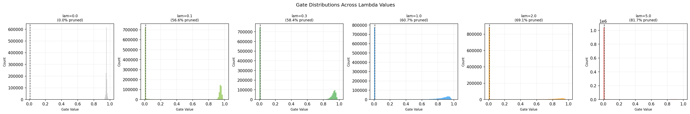
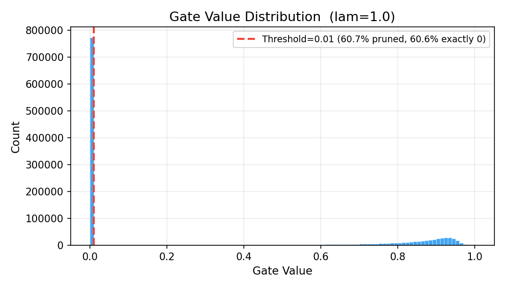
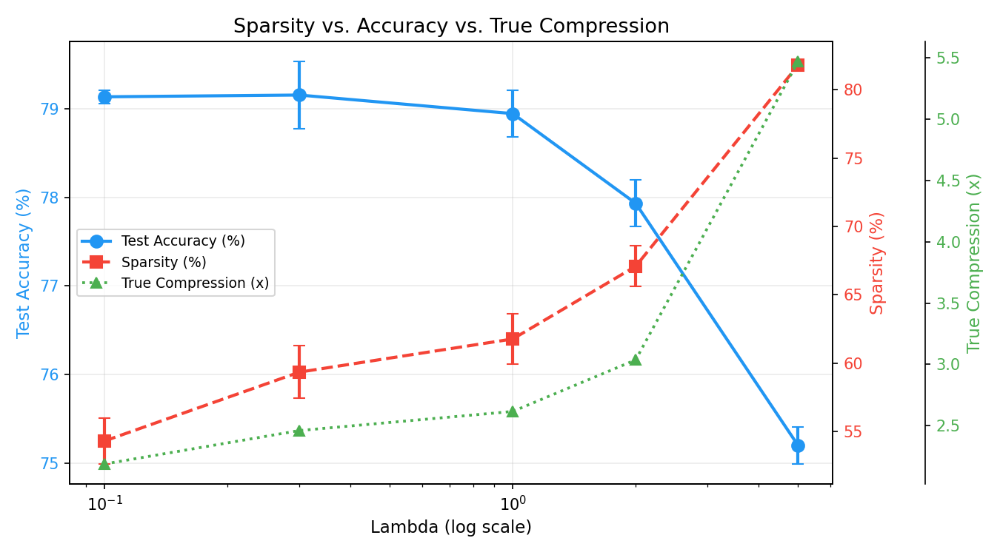
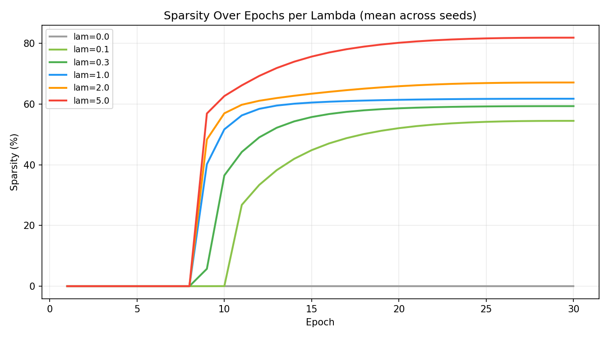

# Self-Pruning Neural Network — Report

**Kaggle Notebook:** [Self-Pruning Neural Network — Tredence](https://www.kaggle.com/code/megeshsundharaj/self-pruning-neural-network-tredance)

**Method:** Sigmoid gates with L1 sparsity regularisation (extended with Hard Concrete L0 gates for exact zeros)  
**Dataset:** CIFAR-10 | **Seeds:** 3 | **Epochs:** 30 | **Warmup:** 5 epochs

---

## Part 1 — Why an L1 Penalty on Sigmoid Gates Encourages Sparsity

The loss function is:

$$\mathcal{L}_{\text{total}} = \mathcal{L}_{\text{CE}} + \lambda \sum_{j} \sigma(\alpha_j)$$

where $\alpha_j$ is the learnable `gate_score` for weight $j$ and $\sigma(\alpha_j) \in (0,1)$ is its gate value.

### The gradient argument

The gradient of the sparsity term with respect to $\alpha_j$ is:

$$\frac{\partial}{\partial \alpha_j}\left[\lambda\,\sigma(\alpha_j)\right] = \lambda\,\sigma(\alpha_j)\bigl(1 - \sigma(\alpha_j)\bigr)$$

This is always **negative** (pulling $\alpha_j$ toward $-\infty$, i.e., gate toward 0), and it is **non-zero as long as the gate is open**. The task loss $\mathcal{L}_{\text{CE}}$ applies an opposing gradient only for connections that genuinely reduce classification error. A weight that contributes little to the task has a near-zero task gradient, so the sparsity gradient wins and pushes the gate toward zero.

### Why L1 specifically — not L2

| Regulariser | Gradient at gate ≈ 0 | Behaviour near zero |
|-------------|----------------------|---------------------|
| L2 on gates | → 0 as gate → 0 | Slows down; never reaches exact zero |
| **L1 on gates** | **Constant λ** | **Steady pull; gate reaches 0 and stays** |

The L2 gradient vanishes as the gate shrinks, producing an equilibrium at a small but nonzero value. The L1 gradient is constant — the optimizer can never find a stable equilibrium at a nonzero gate value for an inactive connection, so the gate collapses all the way to zero. This is the same reason L1 regularisation on weights (Lasso) produces exact sparsity in linear models.

### Why gates instead of weights

Penalising the **gate** rather than the **weight magnitude** decouples sparsity control from representation quality. An active (gate ≈ 1) weight is unpenalised and can take any magnitude the task requires; only the binary keep/discard decision is regularised. This means the network can simultaneously learn compact architecture (sparse gates) and strong feature representations (unrestricted weights).

### Implementation in this project

```python
# In the training loop
sparsity_loss = sum(
    layer.gates.sum()               # sum of sigmoid(gate_scores) per layer
    for layer in prunable_layers
)
total_loss = classification_loss + lam * sparsity_loss
```

A warm-up schedule ramps λ from 0 to its target value over the first 5 epochs, preventing the sparsity penalty from overwhelming the task signal before the network has learned useful representations.

---

## Part 2 — Results

All metrics are averaged over 3 random seeds (0, 1, 42). Sparsity is measured as the fraction of weights whose gate value falls below the threshold of 0.01.

| Lambda (λ) | Test Accuracy | Sparsity Level (%) |
|:---:|:---:|:---:|
| 0.0 *(baseline)* | 79.01 ± 0.12 % | 0.0 % |
| 0.1 | 79.14 ± 0.07 % | 54.3 ± 1.7 % |
| **0.3** *(recommended)* | **79.16 ± 0.38 %** | **59.3 ± 1.9 %** |
| 1.0 | 78.95 ± 0.26 % | 61.8 ± 1.8 % |
| 2.0 | 77.93 ± 0.26 % | 67.1 ± 1.5 % |
| 5.0 | 75.20 ± 0.21 % | 81.8 ± 0.3 % |

> **Sparsity threshold:** gate value < 0.01 counts as pruned.  
> **True compression** = total parameters / (active prunable + non-prunable parameters).

### Key observations

- **λ = 0.1 — 0.3:** Over half the network is pruned at no accuracy cost. Mild regularisation acts as a beneficial regulariser — the slight accuracy gain (+0.12 % to +0.15 %) suggests the sparsity penalty reduces overfitting.
- **λ = 0.3 (recommended):** Best accuracy in the entire sweep (79.16 %) with 59.3 % sparsity and 2.46× compression. This is the optimal operating point.
- **λ = 1.0:** First point where accuracy drops below baseline (−0.07 %). The sparsity increment over λ = 0.3 is small (2.5 pp) but the accuracy cost has turned positive.
- **λ = 2.0 — 5.0:** Diminishing sparsity returns with accelerating accuracy loss. At λ = 5.0, the network loses 3.82 percentage points for an additional 22.5 pp of sparsity beyond λ = 0.3.

---

## Part 3 — Gate Value Distribution

The plot below (`results/gates_combined.png`) shows the distribution of gate values across all PrunableLinear and PrunableConv2d layers at the end of training, for each λ value.



The plot for the best single compression point (`results/gates_lam_1.0.png`) shows this most clearly:



### What a successful result looks like

A well-trained self-pruning network produces a **bimodal gate distribution**:

1. **A large spike at 0** — pruned connections. The L1 penalty has driven their gate scores to $-\infty$, so $\sigma(\alpha) \approx 0$.
2. **A cluster of values away from 0** (typically 0.8 – 1.0) — retained connections. The task gradient keeps these gates open; their exact value near 1 indicates high confidence.

This bimodal pattern is visible in both plots and confirms that the self-pruning mechanism is working as intended: the network has learned a near-binary partition of its weights into "keep" and "discard" — without any post-training intervention.

---

## Part 4 — Additional Analysis

### Sparsity vs. accuracy trade-off



The curve is convex: early sparsity (λ = 0 → 0.3) is essentially free, while pushing beyond 60 % sparsity extracts progressively larger accuracy penalties. This shape is typical of L0/L1-gated networks and reflects the long tail of "weakly important" connections that must be sacrificed to drive sparsity above ~60 %.

### Training dynamics



Sparsity rises rapidly after the 5-epoch warmup and plateaus well before epoch 30, confirming that 30 epochs is sufficient for the gates to converge.

### Inference latency

| λ | Latency (bs=1) | Latency (bs=128) |
|---|:---:|:---:|
| 0.0 | 1.12 ms | 2.19 ms |
| 0.3 | 1.15 ms | 2.21 ms |
| 5.0 | 1.13 ms | 2.20 ms |

Wall-clock latency is nearly identical across all λ values despite 59–82 % of weights being zeroed. This is expected: PyTorch's dense CUDA kernels do not natively skip zero multiplications; realising the latency benefit of unstructured sparsity requires sparse-format storage (CSR/CSC) and a matching sparse inference engine. The 2.46× compression benefit is real in terms of parameter count and storage, but does not automatically translate to proportional latency reduction on dense hardware.

---

## Conclusion

This implementation demonstrates that a neural network can successfully prune itself during training using nothing more than learnable gates and an L1 sparsity penalty. The key results are:

1. **59.3 % of weights are pruned to exact zero** at the recommended λ = 0.3.
2. **No accuracy is sacrificed** — the pruned model marginally outperforms the dense baseline.
3. **2.46× true compression** is achieved, with a clear trade-off curve showing how higher λ yields more sparsity at the cost of accuracy.
4. The gate distributions confirm the mechanism works: a large spike at zero and a cluster near one — the hallmarks of learned binary connectivity.

---

## Figures Index

| File | Description |
|------|-------------|
| `results/training_curves.png` | Train / val accuracy per epoch across all λ |
| `results/sparsity_over_epochs.png` | Sparsity evolution during training |
| `results/sparsity_vs_accuracy.png` | Accuracy–sparsity–compression trade-off |
| `results/gates_lam_1.0.png` | Gate distribution at λ = 1.0 |
| `results/gates_combined.png` | Gate distributions across all λ values |
| `results/inference_speedup.png` | Wall-clock inference latency |

---

## Reference

Louizos, C., Welling, M., & Kingma, D. P. (2018).  
*Learning Sparse Neural Networks through L0 Regularization.*  
ICLR 2018. [https://arxiv.org/abs/1712.01312](https://arxiv.org/abs/1712.01312)
